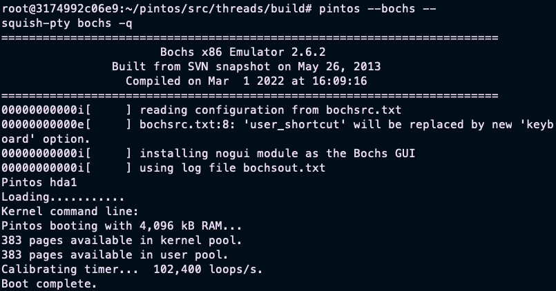

# Project 0: Getting Real

## Preliminaries

>Fill in your name and email address.

Zhou Ziqi <2021141440118@stu.scu.edu.cn>

>If you have any preliminary comments on your submission, notes for the TAs, please give them here.


>Please cite any offline or online sources you consulted while preparing your submission, other than the Pintos documentation, course text, lecture notes, and course staff.


## Booting Pintos

>A1: Put the screenshot of Pintos running example here.

<b> qemu simulator screenshot:


<b> bochs simulator screenshot:



## Debugging

#### QUESTIONS: BIOS 

>B1: What is the first instruction that gets executed?

```x86asm
ljmp $0x3630,$0xf000305b
```

>B2: At which physical address is this instruction located?

0xffff0


#### QUESTIONS: BOOTLOADER

>B3: How does the bootloader read disk sectors? In particular, what BIOS interrupt is used?

Bootloader firstly pushs all general regs into stack, then push the required options into a packet. Move 0x42 to ah reg corresponding to extended read in the interupt vector table and use int instruction to call BIOS to read Extended Sector.


>B4: How does the bootloader decides whether it successfully finds the Pintos kernel?


After reading the first sector, bootloader check if the content at the image address + 4 bytes equals to 0x20. If yes, then load the image.

>B5: What happens when the bootloader could not find the Pintos kernel?

Puts "Not Found" and notify BIOS that boot failed. [See no_boot_partition]

>B6: At what point and how exactly does the bootloader transfer control to the Pintos kernel?

After call pintos_init() function [See kernel.o]

#### QUESTIONS: KERNEL

>B7: At the entry of pintos_init(), what is the value of expression `init_page_dir[pd_no(ptov(0))]` in hexadecimal format?

0x0

>B8: When `palloc_get_page()` is called for the first time,

>> B8.1 what does the call stack look like?
>> #0  palloc_get_page (flags=(PAL_ASSERT | PAL_ZERO)) at ../../threads/palloc.c:113
>> #1  0xc00203aa in paging_init () at ../../threads/init.c:168
>> #2  0xc002031b in pintos_init () at ../../threads/init.c:100
>> #3  0xc002013d in start () at ../../threads/start.S:180

>> B8.2 what is the return value in hexadecimal format?
>> 0xc0101000

>> B8.3 what is the value of expression `init_page_dir[pd_no(ptov(0))]` in hexadecimal format?
>> 0x0

>B9: When palloc_get_page() is called for the third time,

>> B9.1 what does the call stack look like?
>> #0  0xc0020a81 in thread_create (name=0xc002e895 "idle", priority=0, function=0xc0020eb0 <idle>, aux=0xc000efbc) at ../../threads/thread.c:178
>> #1  0xc0020976 in thread_start () at ../../threads/thread.c:111
>> #2  0xc0020334 in pintos_init () at ../../threads/init.c:119
>> #3  0xc002013d in start () at ../../threads/start.S:180

>> B9.2 what is the return value in hexadecimal format?
>> 0xc0103000

>> B9.3 what is the value of expression `init_page_dir[pd_no(ptov(0))]` in hexadecimal format?
>> 0x102027

## Kernel Monitor

>C1: Put the screenshot of your kernel monitor running example here. (It should show how your kernel shell respond to `whoami`, `exit`, and `other input`.)


#### 

>C2: Explain how you read and write to the console for the kernel monitor.

read from console using given function `input_getc` and store the character into a buffer, then using `printf` to write to the console.